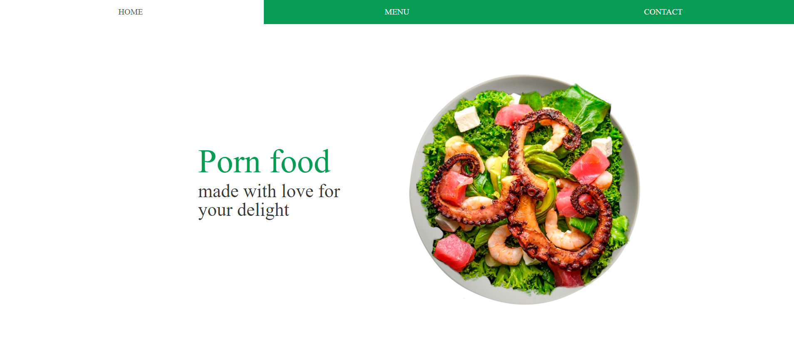
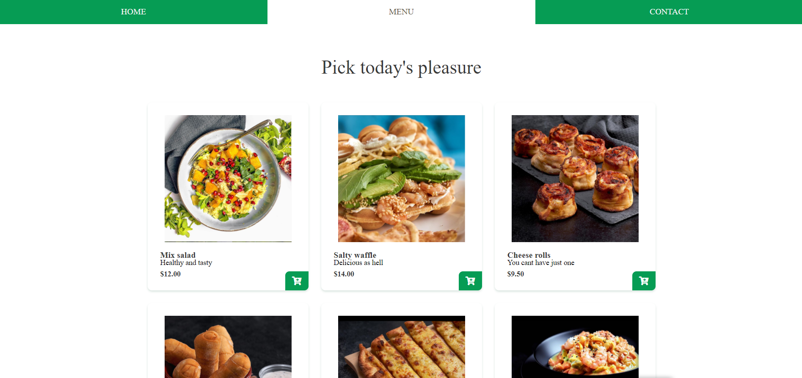

# Restaurant Porn Food

- Restaurant app buildt with javascript, webpack & sass. Totally responsive using grid & Tabsy template.




## Live Demo

[Live version](https://karmaester.github.io/Restaurant-JS/)

## :hammer: Built With

- Javascript
- HTML
- Sass
- Webpack

## :construction_worker: Getting Started

To get a local copy up and running follow these simple example steps.

### Setup

- Open the console
- Download or git clone https://github.com/karmaester/Books-Books
- cd Books-Books

Install npm:

```
  npm install
```

- Open index.html file in browser

### Github Actions

To make sure the linters' checks using Github Actions work properly, you should follow the next steps:

1. On your recent repo, enable the GitHub Actions in the Actions tab.
2. Create the `feature/branch` and push.
3. Open a PR from the `feature/branch` when your work is done.

## :bust_in_silhouette: Author

👤 **Khristian Rojas**

- Github: [@githubhandle](https://github.com/karmaester)
- Twitter: [@twitterhandle](https://twitter.com/karmaendlich)
- Linkedin: [linkedin](https://www.linkedin.com/in/khristian-rojas/)

## 🤝 :raised_hand: :raised_hand: Contributing

Contributions, issues and feature requests are welcome!

Feel free to check the [issues page](https://github.com/karmaester/Restaurant-JS/issues).

## :muscle: Show your support

Give a ⭐️ if you like this project!

## :grey_exclamation: Acknowledgments

- Microverse
- Stand up Team
- bedimcode

## 📝 License

This project is [MIT](https://opensource.org/licenses/MIT) licensed.
